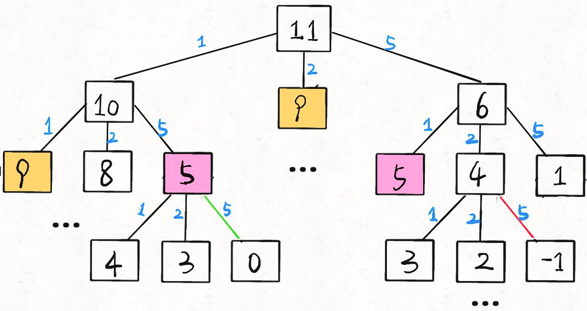

\# Framework and thoughts about learning data structure and algorithmv

# Framework and thoughts about learning data structure and algorithm

Don’t dwell on the details, this article is used to build an overview of framework thinking of data structure and algorithm. The framework thinking is from the whole to the details, from the top to the bottom and from abstract to the concrete. 

## 1.Storage mode of data structure

**There are only two ways to store data structure: array (sequential storage) and linked list (linked storage)**. The other data structure such as queue, stack, heap, tree, graph are diversified from array and list, the source of them are all special operations on linked lists or arrays. So array and list are also called “structural basis”.

Hashtable maps keys to a large array through hash function. And to solve hash conflict, chaining needs linked list feature, with simple operation, but needs extra space to store pointer; linear exploration method needs array feature, to address continuously, and doesn’t need storage space of pointer.

The implement of “tree” with array is “heap”, because heap is a complete binary tree, and the storage of array doesn’t need node pointer, the operation is relatively simple. But tree isn’t suitab;e to use array storage. 

Redis database provides lists, strings, collections and other common data structures. However, for each data structure, there are at least two underlying storage methods to facilitate the use of appropriate storage methods.

**The advantages and disadvantages of the two are as follows:**

Array is compact and continuous storage, which can be accessed randomly, and it can find corresponding elements quickly through index and save storage space relatively. But just because of the continuous storage, the memory space must be allocated enough at one time 

- So if the array is to be expanded, it needs to reallocate a larger space, and copy all data, the time complexity O(n)
- And if insert or delete an element, we need to move all the data behind each time to maintain the continuity, the time complexity O(n)

**linked list**:

- If we know the precursor and the hind drive of an element, the operation pointer can delete the element or insert a new a element, with time complexity of O(1).
- Because the storage is not continuous, we can’t calculate the address of the corresponding element according to an index, i.e. we can’t access it randomly.
- Consume more storage relatively.

## 2.Basic operation of data structure

Basic operation is no more than traversal + access, more specific: **add, delete, search and modify.**
From the highest level that traversal and access of various data structures are in two forms: **linear and nonlinear.**                                                                                                   
Linear is represented by for / while iteration, and nonlinear is represented by recursion.                                                                                                                                                                                                                                                                                                                                                                                                                                                                                                                                                                                                                                                                                                                                                                                                                                                                                                                                                                                                                                                                                                                                                                                                                                                                                                                                                                                                                                                                                                                                                                                                                                                                                                                                                                                                                                                                                                                                                                                                                                                                                                                                                                                                                                                                                                                                                                                                                                                                                                                                                                                                                                                                                                                                                                                                                                                                                                                                                                                                                                                                                                                                                                                                                                                                                               

Array traversal framework, typical linear iterative structure：

```java
void traverse(int[] arr) {
    for (int i = 0; i < arr.length; i++) {
        // iteratively visit arr[i]
    }
}
```

Linked list traversal framework has both iterative and recursive structure：

```java
/* Basic node of the single linked list */
class ListNode {
    int val;
    ListNode next;
}

void traverse(ListNode head) {
    for (ListNode p = head; p != null; p = p.next) {
        // iteratively p.val
    }
}

void traverse(ListNode head) {
    // recusively head.val
    traverse(head.next)
}
```
Binary tree traversal framework, typical nonlinear recursive traversal structure：

```java
/* Basic node of the binary tree */
class TreeNode {
    int val;
    TreeNode left, right;
}

void traverse(TreeNode root) {
    traverse(root.left)
    traverse(root.right)
}
```

The binary tree framework can be extended to the n-tree traversal framework：

```java
/* Basic node of the N-tree */
class TreeNode {
    int val;
    TreeNode[] children;
}

void traverse(TreeNode root) {
    for (TreeNode child : root.children)
        traverse(child)
}
```

N-tree traversal can be extended to graph traversal, because graph is a combination of several n-tree.

**No matter add, delete, insert or modify, these codes are never separated from the structure. You can take this structure as the outline and add code on the framework according to specific problems.**

## 3.Guidelines of Algorithm Exercises

First of all, it should be clear **that data structure is a tool, and algorithm is a method to solve specific problems through appropriate tools.**

So how to practice in leetcode? **Do binary tree exercises first! Do binary tree exercises first! Do binary tree exercises first!**

post order traversal / middle order traversal / 

For a person who understands binary trees, it won't take long to do exercises of a binary tree. So if you can't or are afraid of working out questions, you can start from the binary tree. The first 10 may be a little uncomfortable. If you do another 20 with the framework, you may have some understanding. If you finish that, and then do any backtracking , dynamic programming or divide-and-conquer topic, you will find that **as long as recursion is involved, it's all a tree problem.***



```python
def coinChange(coins: List[int], amount: int):

    def dp(n):
        if n == 0: return 0
        if n < 0: return -1

        res = float('INF')
        for coin in coins:
            subproblem = dp(n - coin)
            # no solution for sub questions 
            if subproblem == -1: continue
            res = min(res, 1 + subproblem)
        return res if res != float('INF') else -1
    
    return dp(amount)
```

What if I can't read so much code? Directly extract the framework, you can see the core idea：

```python
# a traverse problem of n-tree
def dp(n):
    for coin in coins:
        dp(n - coin)
```

\## 4.Summary

The basic storage mode of data structure is chain and order. The basic operation is to add, delete, search and modify. The traversal mode is nothing but iteration and recursion.

It is suggested to start from "tree" and finish these dozens of questions in combination with frame thinking. The understanding of tree structure should be in place. At this time, if you look at the topics of backtracking, dynamic rules, divide and conquer, you may have a deeper understanding of the ideas.